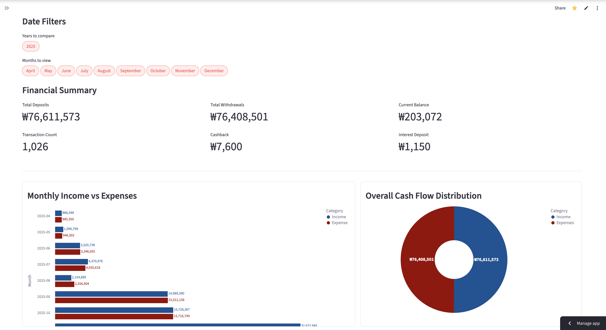
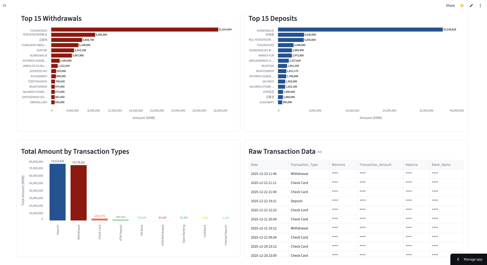

# Financial Transactions Dashboard

A secure, interactive Streamlit dashboard for analyzing personal financial transaction history.

## Overview
This dashboard allows users to visualize their income, expenses, and net income trends over time. It processes standard transaction Excel files and provides actionable insights through interactive charts and key performance indicators (KPIs).

## Features
-   **Security First**: Data is processed locally in memory. No files are uploaded to any external server.
-   **Privacy Mode**: Built-in toggle to mask sensitive transaction details (Remarks, Balance, Amounts) during demonstrations.
-   **Interactive Filtering**: Filter data by Year and Month to analyze specific periods.
-   **Comprehensive Analysis**:
    -   Monthly Income vs. Expenses
    -   Cash Flow Distribution
    -   Net Income Analysis
    -   Hourly Transaction Heatmap
    -   Top 15 Deposit/Withdrawal Categories

## How it Looks

### Dashboard Overview


### Drill-Down Analysis


### Data & Privacy


## Getting Started

### Prerequisites
-   Python 3.8+
-   `pip`

### Installation
1.  Clone the repository:
    ```bash
    git clone https://github.com/yourusername/transactions-dashboard-streamlit.git
    cd transactions-dashboard-streamlit
    ```
2.  Install dependencies:
    ```bash
    pip install -r requirements.txt
    ```

### Running the App
Run the following command in your terminal:
```bash
streamlit run app.py
```
The application will open in your default browser at `http://localhost:8501`.

## Usage
1.  **Launch the App**: Follow the running instructions above.
2.  **Upload Data**: Drag and drop your transaction Excel file (`.xlsx`) into the file uploader.
3.  **Analyze**: Use the sidebar to toggle "Privacy Mode" or filter by specific dates. Explore the interactive charts to understand your spending habits.
